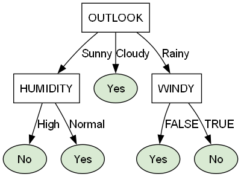

# C4.5 Algorithm - PHP

[](https://packagist.org/packages/medansoftware/c45-algorithm-php)
[](https://github.com/medansoftware/C45-Algorithm-PHP/actions/workflows/tests.yml)
[](composer.json)
[](LICENSE)

A PHP implementation of the **C4.5 decision tree algorithm**, with support for building a tree from Excel/CSV files or plain PHP arrays, classifying new data, evaluating predictions, and exporting the resulting tree as a string, JSON, array, or Graphviz DOT diagram.

> 📄 [Example spreadsheet](examples/example.xlsx)

## Table of Contents

- [C4.5 Algorithm - PHP](#c45-algorithm---php)
	- [Table of Contents](#table-of-contents)
	- [Features](#features)
	- [Requirements](#requirements)
	- [Installation](#installation)
	- [Quick Start](#quick-start)
		- [From an Excel File](#from-an-excel-file)
		- [From a PHP Array](#from-a-php-array)
		- [From a CSV File](#from-a-csv-file)
	- [Classifying New Data](#classifying-new-data)
		- [Missing Values](#missing-values)
	- [Evaluating Accuracy](#evaluating-accuracy)
	- [Output Formats](#output-formats)
		- [As String](#as-string)
		- [As JSON](#as-json)
		- [As Array](#as-array)
		- [As Graphviz DOT Diagram](#as-graphviz-dot-diagram)
	- [Project Structure](#project-structure)
	- [Running Tests](#running-tests)
	- [Upgrading from 2.0.0](#upgrading-from-200)
	- [License](#license)

## Features

- Build C4.5 decision trees from Excel, CSV, or PHP array data.
- Calculate Gain, Split Info, and Gain Ratio.
- Classify new records using a built decision tree.
- Handle missing split-attribute values during classification by falling back to the majority branch.
- Evaluate a tree against labeled test data.
- Export trees as:
  - String
  - JSON
  - PHP array
  - Graphviz DOT
- Use PSR-4 autoloading through Composer.
- Includes a PHPUnit test suite and GitHub Actions CI.
- Uses an indexed data lookup internally to reduce repeated full-dataset scans while building trees.

## Requirements

- PHP ^8.1
- [phpoffice/phpspreadsheet](https://github.com/PHPOffice/PhpSpreadsheet) ^2.0 || ^3.0

> **PHP 5.x–7.x compatibility:** If your project is running PHP 5.x, 6.x, or 7.x, use a package version **below `2.0.0`**.
>
> Version `2.0.0` and later require PHP ^8.1. For older PHP versions, install the latest compatible `1.x` release:
>
> ```bash
> composer require medansoftware/c45-algorithm-php:"<2.0.0"
> ```

## Installation

Install via [Composer](https://getcomposer.org):

```bash
composer require medansoftware/c45-algorithm-php
```

## Quick Start

### From an Excel File

```php
$c45 = new Algorithm\C45('examples/example.xlsx', 'PLAY');

$tree = $c45->initialize()->buildTree();

echo $tree->toString();
```

Or, using the fluent setup:

```php
$c45 = new Algorithm\C45();
$c45->loadFile('examples/example.xlsx');
$c45->setTargetAttribute('PLAY');

$tree = $c45->initialize()->buildTree();

echo $tree->toString();
```

### From a PHP Array

```php
$data = [
    ['OUTLOOK' => 'Sunny',  'TEMPERATURE' => 'Hot',  'HUMIDITY' => 'High',   'WINDY' => 'False', 'PLAY' => 'No'],
    ['OUTLOOK' => 'Sunny',  'TEMPERATURE' => 'Hot',  'HUMIDITY' => 'High',   'WINDY' => 'True',  'PLAY' => 'No'],
    ['OUTLOOK' => 'Cloudy', 'TEMPERATURE' => 'Hot',  'HUMIDITY' => 'High',   'WINDY' => 'False', 'PLAY' => 'Yes'],
    ['OUTLOOK' => 'Rainy',  'TEMPERATURE' => 'Mild', 'HUMIDITY' => 'High',   'WINDY' => 'False', 'PLAY' => 'Yes'],
    ['OUTLOOK' => 'Rainy',  'TEMPERATURE' => 'Cool', 'HUMIDITY' => 'Normal', 'WINDY' => 'False', 'PLAY' => 'Yes'],
    ['OUTLOOK' => 'Rainy',  'TEMPERATURE' => 'Cool', 'HUMIDITY' => 'Normal', 'WINDY' => 'True',  'PLAY' => 'No'],
    ['OUTLOOK' => 'Cloudy', 'TEMPERATURE' => 'Cool', 'HUMIDITY' => 'Normal', 'WINDY' => 'True',  'PLAY' => 'Yes'],
    ['OUTLOOK' => 'Sunny',  'TEMPERATURE' => 'Mild', 'HUMIDITY' => 'High',   'WINDY' => 'False', 'PLAY' => 'No'],
    ['OUTLOOK' => 'Sunny',  'TEMPERATURE' => 'Cool', 'HUMIDITY' => 'Normal', 'WINDY' => 'False', 'PLAY' => 'Yes'],
    ['OUTLOOK' => 'Rainy',  'TEMPERATURE' => 'Mild', 'HUMIDITY' => 'Normal', 'WINDY' => 'False', 'PLAY' => 'Yes'],
    ['OUTLOOK' => 'Sunny',  'TEMPERATURE' => 'Mild', 'HUMIDITY' => 'Normal', 'WINDY' => 'True',  'PLAY' => 'Yes'],
    ['OUTLOOK' => 'Cloudy', 'TEMPERATURE' => 'Mild', 'HUMIDITY' => 'High',   'WINDY' => 'True',  'PLAY' => 'Yes'],
    ['OUTLOOK' => 'Cloudy', 'TEMPERATURE' => 'Hot',  'HUMIDITY' => 'Normal', 'WINDY' => 'False', 'PLAY' => 'Yes'],
    ['OUTLOOK' => 'Rainy',  'TEMPERATURE' => 'Mild', 'HUMIDITY' => 'High',   'WINDY' => 'True',  'PLAY' => 'No'],
];

$input = new Algorithm\C45\DataInput();
$input->setData($data);
$input->setAttributes(['OUTLOOK', 'TEMPERATURE', 'HUMIDITY', 'WINDY', 'PLAY']);

$c45 = new Algorithm\C45();
$c45->c45 = $input;
$c45->setTargetAttribute('PLAY');

$tree = $c45->initialize()->buildTree();

echo $tree->toString();
```

### From a CSV File

```php
$input = new Algorithm\C45\DataInput();
$input->loadCsv('example.csv'); // delimiter defaults to ','

$c45 = new Algorithm\C45();
$c45->c45 = $input;
$c45->setTargetAttribute('PLAY');

$tree = $c45->initialize()->buildTree();

echo $tree->toString();
```

## Classifying New Data

```php
$newData = [
    'OUTLOOK'     => 'Sunny',
    'TEMPERATURE' => 'Hot',
    'HUMIDITY'    => 'High',
    'WINDY'       => 'False',
];

echo $tree->classify($newData); // "No"
```

### Missing Values

If the split attribute required by a tree node is missing (`null` or an empty string), classification falls back to the branch with the highest number of training instances at that node.

This is useful when prediction data is incomplete:

```php
$newData = [
    'TEMPERATURE' => 'Hot',
    'HUMIDITY'    => 'High',
    'WINDY'       => 'False',
    // OUTLOOK is missing
];

echo $tree->classify($newData);
```

If a value is present but was never observed during training, the result remains:

```text
unclassified
```

## Evaluating Accuracy

Measure how well a built tree performs against a labeled test set:

```php
$result = $c45->evaluate($tree, $testData);

echo $result['accuracy'];          // e.g. 0.86
echo $result['correct'] . '/' . $result['total'];
print_r($result['misclassified']);
```

The returned structure is:

```php
[
    'accuracy'      => 0.86,
    'correct'       => 86,
    'total'         => 100,
    'misclassified' => [
        // rows that were classified incorrectly
    ],
]
```

## Output Formats

### As String

```php
echo $tree->toString();
```

### As JSON

```php
echo $tree->toJson();
```

### As Array

```php
print_r($tree->toArray());
```

### As Graphviz DOT Diagram

Useful for visualizing the tree with tools like [Graphviz Online](https://dreampuf.github.io/GraphvizOnline/) or the `dot` CLI:

```php
file_put_contents('tree.dot', $tree->toDot());
```

```bash
dot -Tpng tree.dot -o tree.png
```

The repository contains a generated example based on the Play Tennis dataset:

- [`examples/example.xlsx`](examples/example.xlsx)
- [`examples/tree.dot`](examples/tree.dot)
- [`examples/tree.png`](examples/tree.png)



## Project Structure

```text
.
├── .github/
│   └── workflows/
│       └── tests.yml
├── examples/
│   ├── example.xlsx
│   ├── tree.dot
│   └── tree.png
├── src/
│   ├── C45.php
│   └── C45/
│       ├── Calculator/
│       ├── DataInput/
│       ├── DataInput.php
│       └── TreeNode.php
├── tests/
├── composer.json
├── phpunit.xml
├── CHANGELOG.md
└── LICENSE
```

## Running Tests

Install dependencies:

```bash
composer install
```

Run the test suite:

```bash
composer test
```

The GitHub Actions workflow runs the PHPUnit suite on PHP 8.1, 8.2, and 8.3 for pushes and pull requests targeting the `master` and `develop` branches.

## Upgrading from 2.0.0

The public namespace remains `Algorithm\C45`, but the package now uses Composer PSR-4 autoloading instead of classmap autoloading.

The implementation also introduces stricter parameter and return types. Existing valid usage should continue to work, but invalid argument types may now fail earlier with a `TypeError`.

The main behavioral change is how incomplete data is handled:

- Missing values (`null` or `''`) are excluded from attribute classes and criteria indexes.
- During classification, a missing split attribute falls back to the majority branch.
- An unseen, non-empty attribute value still returns `unclassified`.

No application-level namespace migration is required.

## License

Released under the [MIT License](LICENSE).

---

[Reference](https://github.com/juliardi/C45)

<p align="center"><b>Made with ❤️ + ☕ ~ Agung Dirgantara</b></p>
